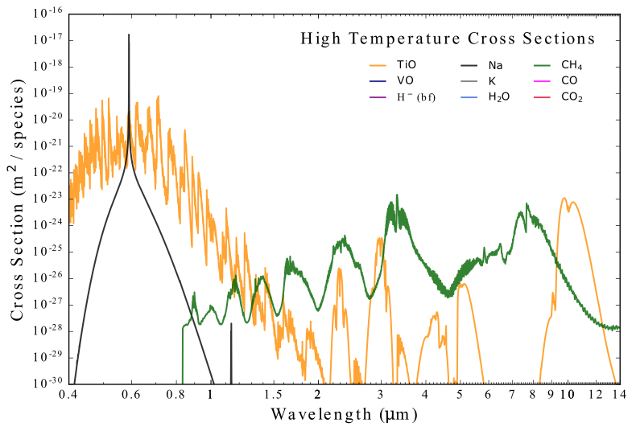

Introduction
------------

Here we briefly outline why molecular or atomic cross sections are important for
studies of substellar atmospheres, how they are calculated, and what Cthulhu brings
to the table as a Python package. We assume no prior knowledge of cross sections.

Part 1: A Beginner's Guide to Cross Sections
^^^^^^^^^^^^^^^^^^^^^^^^^^^^^^^^^^^^^^^^^^^^

Cross sections are used extensively, especially in atmospheric, climate science, 
and planetary astronomy. A cross section encodes the universal physics of how 
light interacts with the various gases present in an atmosphere, whether it be 
for the Earth, Mars, and exoplanet, or a brown dwarf.

A cross section can be considered as the wavelength-dependent `effective area` 
a chemical species (a molecule, atom, or ion) presents to a beam of light 
(with units conventionally expressed in :math:`\mathrm{cm}^2`). Equivalently, a 
cross section can be considered an expression of the probability of a photon to 
interact with a given chemical species as a function of wavelength. The temperature
`opacity` is often used interchangeably with cross section.

An absorption cross section is the sum of the absorption profiles of many 
individual quantum mechanical transitions (called a `line`). Transitions can be
electronic (e.g. for atoms), rotation-vibration transitions (most molecular 
transitions), or some combination thereof. Each transition has an intrinsic
strength (`intensity`) and a shape (`profile`), where the intensity is influenced 
by temperature and quantum state properties and the shape is influenced by both 
temperature and pressure (`broadening`). Line profiles are usually modelled as 
Voigt profiles (a convolution of a Lorentzian and Gaussian function) for exoplanet
or brown dwarf applications (though more accurate line shapes are sometimes used 
for remote sensing applications in the Solar System).

To calculate a cross section as a function of wavelength, temperature, and pressure
one needs to know the central wavelength of each transition (the `line core`) and 
various properties specifying the line shape parameters (e.g. Einstein A coefficients, 
line intensities at a reference temperature). Various online databases — such as
HITRAN, ExoMol, and VALD — tabulate these quantities for a wide collection of 
transitions for a given chemical species (a `line list`).

For the mathematical equations and algorithm used in Cthulhu to calculate cross 
sections, we refer the reader to `MacDonald (2019), Chapter 5 
<https://www.repository.cam.ac.uk/items/6131cefa-e4e8-4374-abf6-b6005d75702e>`_.

Below is an illustrative plot of several cross sections as a function of wavelength 
(at 2000 K and 1 bar) from `MacDonald & Lewis (2022) 
<https://ui.adsabs.harvard.edu/abs/2021arXiv211105862M/abstract>`_. We see that 
the Na cross section, which is the only atom plotted, has a prominent line 
centred at visible wavelengths near 0.6 μm with broad wings (a resonance doublet),
which corresponds to the electronic transition between the ground and first 
excited state. :math:`\mathrm{CH_4}` instead has a series of bands in the
near-infrared formed by a vast sea of ro-vibrational transitions. Indeed, molecules
like :math:`\mathrm{CH_4}` often have more than 10 billion transitions that need 
to be considered for temperatures :math:`>` 1000 K. Finally, we see that heavy 
metal molecules like TiO have a complex system of bands that can extend to 
visible wavelengths.

The choice of line list database is often driven by the intended application.
Here we summarise several prominent line list databases, focusing on those 
supported by Cthulhu, but this list is non-exhaustive. `HITRAN <https://hitran.org/>`_ 
provides state-of-the-art high accuracy line lists principally for terrestrial 
conditions (:math:`T \sim` 300 K). `HITEMP <https://hitran.org/hitemp/>`_
offers similar quality data for a few molecules valid up to higher temperatures 
(:math:`T \lesssim` 2000 K). `ExoMol <https://www.exomol.com/>`_ offers line lists 
computed using state-of-the-art first principles theoretical calculations, allowing
completeness for high-temperature applications, even at conditions with a lack 
of experimental measurements. ExoMol line lists are often used for cross sections 
in exoplanet and brown dwarf radiative transfer codes. Finally, `VALD <http://vald.astro.uu.se/>`_
provides a curated database of atomic and ionic line lists for most of the 
periodic table.

Part 2: Cthulhu's Features
^^^^^^^^^^^^^^^^^^^^^^^^^^^^

Cthulhu is designed to offer a user-friendly gateway for non-specialists to 
interact with line lists and calculate molecular, atomic, and ionic cross sections.

Functionality
"""""""""""""

* Automatic downloading and formatting of line lists from an online databases.
* Support for ExoMol, HITRAN, HITEMP, and VALD line lists.
* Package grids of cross sections as a function of temperature and pressure into a HDF5 database to integrate with your favourite radiative transfer code.

User-Friendly
"""""""""""""

* Detailed, step-by-step tutorials provided for every feature of Cthulhu.
* Fully written in Python with extensive function documentation, making it easy to understand the underlying code.
* Out-of-the-box publication-quality plots.

High-performance
""""""""""""""""

* Cross section computations are typically performed at ≈100,000 transitions per second on a single core.
* Parallelisation with near linear scaling permits cluster applications for line lists with :math:`\gtrsim 10^9` transitions.
* HDF5 file compression makes it possible to download and store multiple large line lists on a personal laptop.
